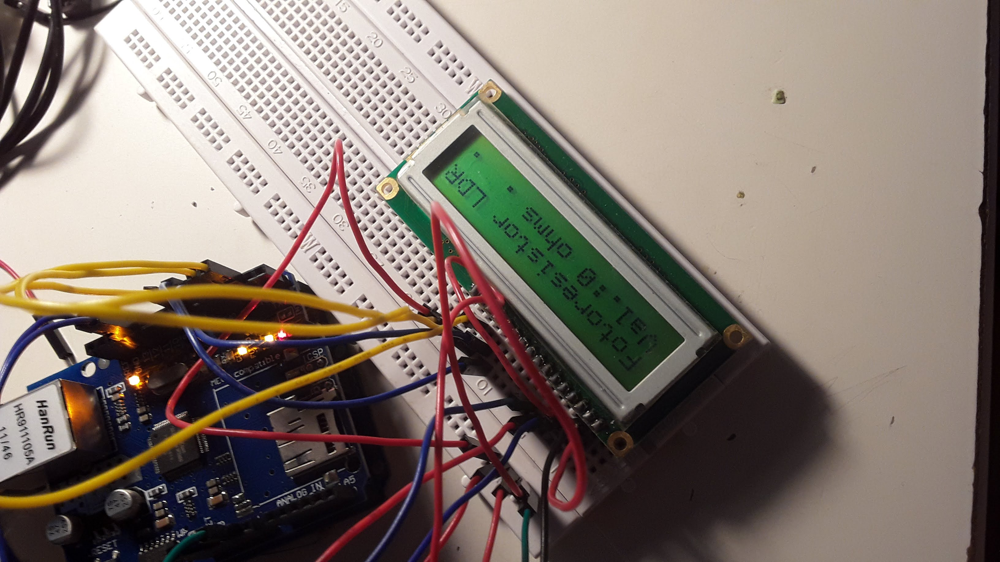

# offline-data
Coleta de dados offline através de placa controladora

# to-do

- [x] Display LCD
- [x] Comunication inter boards
- [] Http Client
- [] Board Sensor1
- [] Board Sensor2
- [] Board Sensor3
- [] Board Sensor4

